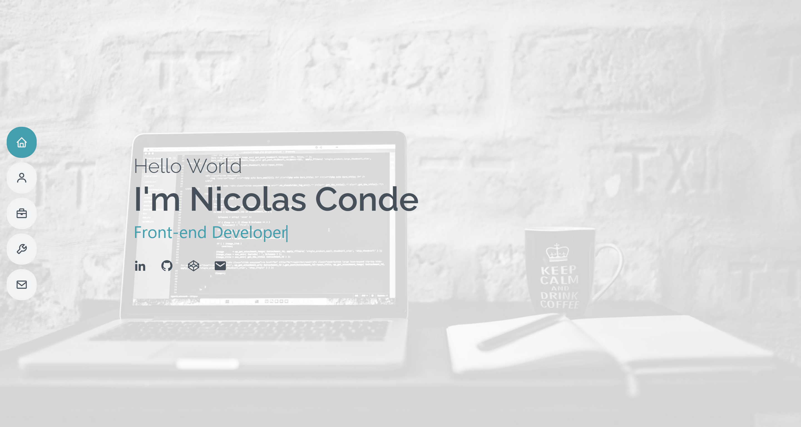

# Portfolio

The website to showcase who i am and the projects that I have been working on, some services and contact section.

## Table of contents

- [Overview](#overview)
  - [The project](#the-project)
  - [Screenshot](#screenshot)
  - [Links](#links)
- [My process](#my-process)
  - [Built with](#built-with)
  - [What I learned](#what-i-learned)
  - [Useful resources](#useful-resources)
- [Author](#author)

## Overview

### The project

Users should be able to:

- Know who I am and the projects I have worked on.

### Screenshot

### Links

- Solution URL: [Solution URL here](https://github.com/ncondes)
- Live Site URL: [Live site URL here](https://www.ncondes.com)

## My process

### Built with

- Semantic HTML5 markup
- CSS custom properties
- Mobile-first workflow
- TailwindCSS
- Sass
- Swiper
- React

### What I learned and put into practice

- React Hooks
- React Portal
- Modals on React
- Display information Dynamiclly

### Useful resources

- [React](https://reactjs.org/) - Documentation of React.

## Author

- Website - [Nicolas Conde Salazar](https://www.ncondes.com)
- Linkedin - [Nicolas Conde Salazar](https://www.linkedin.com/in/ncondes/)
